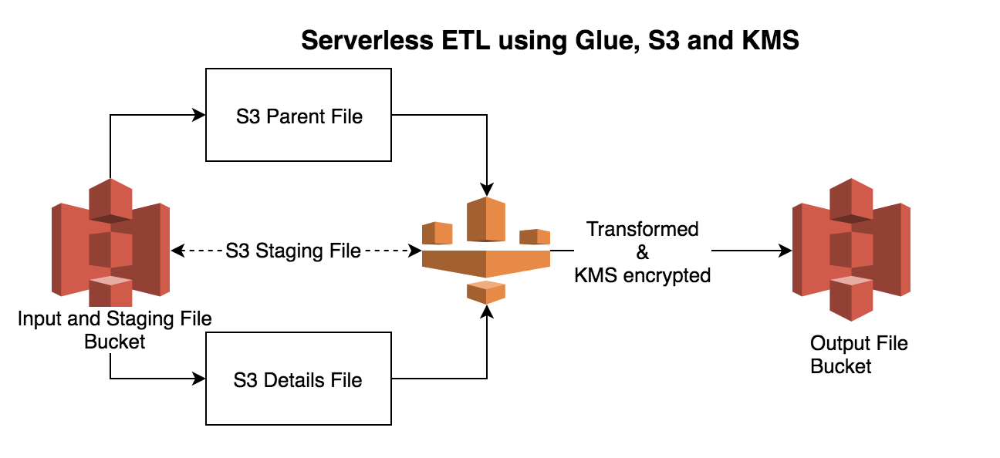

# Tranform Data using Serverless Glue, S3 and KMS
-------------------------------------------------

Below example demonstrates how to read two csv files into pyspark DF using Glue, transform data and stage it and finally apply kms key to encrypt data and store it in target bucket.

Jan-2018 update: There was a new feature introduced for S3 buckets where you can specify KMS key to encrypt data at bucket level or in other words whatever objects land in that bucket can be automatically encrypted using KMS key. Code from line 31 in glue_transform.py is not necessary when S3 bucket is encrypted using KMS key.

## Prerequisites
----------------

## Diagrams
------------

## Program Files
----------------

Glue job file: files/glue_transform.py  
To run glue job: files/run_gluejob.py  

## Sample Input and Output File View
------------------------------------

Sample orders input file:  
order_id,order_date,order_customer_id,order_status  
1,2013-07-25 00:00:00.0,11599,CLOSED  
2,2013-07-25 00:00:00.0,256,PENDING_PAYMENT  
3,2013-07-25 00:00:00.0,12111,COMPLETE  
4,2013-07-25 00:00:00.0,8827,CLOSED  
5,2013-07-25 00:00:00.0,11318,COMPLETE  
...  

Sample order_items input file:  
order_item_id,order_id,order_item_product_id,order_item_quantity,order_item_subtotal,order_item_product_price  
1,1,957,1,299.98,299.98  
2,2,1073,1,199.99,199.99  
3,2,502,5,250.0,50.0  
4,2,403,1,129.99,129.99  
5,4,897,2,49.98,24.99  
6,4,365,5,299.95,59.99  
7,4,502,3,150.0,50.0  
8,4,1014,4,199.92,49.98  
9,5,957,1,299.98,299.98  
10,5,365,5,299.95,59.99  
....  

Sample transformed output from kms encrypted S3 file:  
1,2013-07-25 00:00:00.0,11599,CLOSED,1,957,1,299.98,299.98  
2,2013-07-25 00:00:00.0,256,PENDING_PAYMENT,4,403,1,129.99,129.99  
2,2013-07-25 00:00:00.0,256,PENDING_PAYMENT,3,502,5,250.0,50.0  
2,2013-07-25 00:00:00.0,256,PENDING_PAYMENT,2,1073,1,199.99,199.99  
4,2013-07-25 00:00:00.0,8827,CLOSED,8,1014,4,199.92,49.98  
4,2013-07-25 00:00:00.0,8827,CLOSED,7,502,3,150.0,50.0  
4,2013-07-25 00:00:00.0,8827,CLOSED,6,365,5,299.95,59.99  
....
